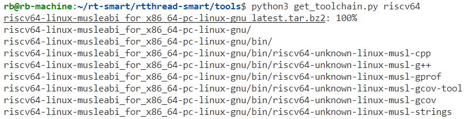
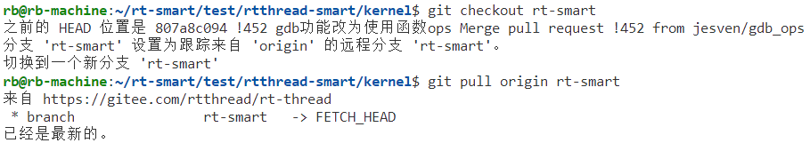
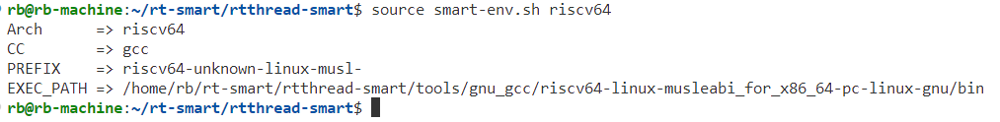
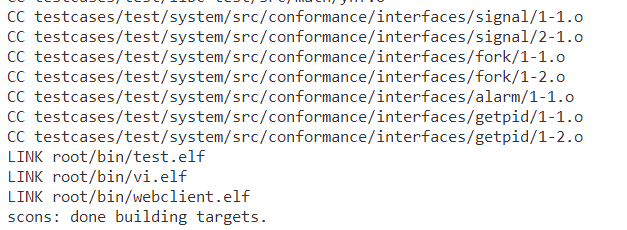
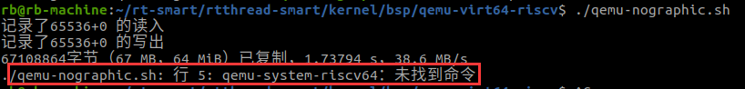

# qemu-riscv64 Smart 环境搭建

## 下载对应工具链

请先下载对应的工具链并展开到 `rtthread-smart/tools/gnu_gcc` 目录，这部分可以在 `rtthread-smart/tools` 目录下运行 `get_toolchain.py` 的脚本：

```shell
python3 get_toolchain.py riscv64
```

后面的工具链名称填写 riscv64，它会自动根据当前的Host开发主机来下载并展开 Windows 或 Linux 的工具链。



## 更新 submodule 子模块

进入 `kernel` 目录，使用以下命令确保已经更新了 submodule

```shell
git submodule init
git submodule update
```

需要注意，子模块更新下来后需要切到 `rt-smart` 分支：

```shell
git checkout rt-smart

# 并把kernel的rt-smart分支更新到最新版本
git pull origin rt-smart
```



## 配置 smart 开发环境

仓库根目录下有个 `smart-env.sh` 和 `smart-env.bat` 脚本，前者用于 Linux 平台，后者用于 Windows 平台。

```shell
source ./smart-env.sh riscv64
```



执行完之后会提示相关信息，检查下相关信息是否正确：

```shell
Arch      => riscv64
CC        => gcc
PREFIX    => riscv64-unknown-linux-musl-
EXEC_PATH => /home/rb/rt-smart/rtthread-smart/tools/gnu_gcc/riscv64-linux-musleabi_for_x86_64-pc-linux-gnu/bin
```

## 编译用户态程序

* 进入 `userapps` 目录运行 scons：




在编译完成应用程序后，需要把应用程序放到 rt-smart 运行环境（根文件系统）中，这里有两种方式：

1. 制作一份 romfs，把应用程序都放到这个 romfs 中，然后转成数组，再和内核编译在一起；
2. 把它放到运行时用的 SD 卡文件系统中，在 qemu-vexpress-a9 则是 sd.bin 文件；

我们这里为了简单起见采用第一种方式：

- qemu riscv 环境更新 ROMFS 源文件命令

```shell
python3 ../tools/mkromfs.py root ../kernel/bsp/qemu-virt64-riscv/applications/romfs.c
```

## 编译与运行 qemu

拷贝 ` kernel/bsp/qemu-vexpress-a9/applications/mnt.c` 到 `applications` 下

```shell
cp ../qemu-vexpress-a9/applications/mnt.c applications/
```

#### BSP 编译

进入到 `kernel/bsp/qemu-virt64-riscv` 目录中，运行 scons 进行编译：

```shell
rb@rb-machine:~/rt-smart/test/rtthread-smart/kernel/bsp/qemu-virt64-riscv$ scons
scons: Reading SConscript files ...
b''
scons: done reading SConscript files.
scons: Building targets ...
scons: building associated VariantDir targets: build
CC build/applications/main.o
CC build/applications/romfs.o
CC build/applications/test/test_mm/test_mm.o
AS /home/rb/rt-smart/test/rtthread-smart/kernel/libcpu/risc-v/virt64/interrupt_gcc.o
AS /home/rb/rt-smart/test/rtthread-smart/kernel/libcpu/risc-v/virt64/startup_gcc.o
LINK rtthread.elf
riscv64-unknown-linux-musl-objcopy -O binary rtthread.elf rtthread.bin
riscv64-unknown-linux-musl-size rtthread.elf
   text    data     bss     dec     hex filename
 293117    3232  148978  445327   6cb8f rtthread.elf
scons: done building targets.
```

#### 运行验证

运行 `/kernel/bsp/qemu-virt64-riscv` 目录下的 `qemu-nographic.sh` 即可：

若出现以下错误，则是没有安装 qemu 和没有配置 RISC-V 64 环境导致的，可以参考 [在 QEMU 上运行 RISC-V 64 位版本的 Linux ](https://zhuanlan.zhihu.com/p/258394849) 配置环境。



配置好环境后，运行 `qemu-nographic.sh` ：

```shell
rb@rb-machine:~/rt-smart/test/rtthread-smart/kernel/bsp/qemu-virt64-riscv$ ./qemu-nographic.sh 

OpenSBI v0.8
   ____                    _____ ____ _____
  / __ \                  / ____|  _ \_   _|
 | |  | |_ __   ___ _ __ | (___ | |_) || |
 | |  | | '_ \ / _ \ '_ \ \___ \|  _ < | |
 | |__| | |_) |  __/ | | |____) | |_) || |_
  \____/| .__/ \___|_| |_|_____/|____/_____|
        | |
        |_|

Platform Name       : riscv-virtio,qemu
Platform Features   : timer,mfdeleg
Platform HART Count : 1
Boot HART ID        : 0
Boot HART ISA       : rv64imafdcsu
BOOT HART Features  : pmp,scounteren,mcounteren,time
BOOT HART PMP Count : 16
Firmware Base       : 0x80000000
Firmware Size       : 92 KB
Runtime SBI Version : 0.2

MIDELEG : 0x0000000000000222
MEDELEG : 0x000000000000b109
PMP0    : 0x0000000080000000-0x000000008001ffff (A)
PMP1    : 0x0000000000000000-0xffffffffffffffff (A,R,W,X)
heap: [0x80ef5322 - 0x872f5322]

 \ | /
- RT -     Thread Smart Operating System
 / | \     5.0.0 build Sep  5 2022
 2006 - 2020 Copyright by rt-thread team
rt_virtio_devices_init done!
file system initialization done!
Hello RISC-V
msh />ls
Directory /:
bin                 <DIR>                    
msh />cd b
msh />cd bin/
msh /bin>ls
Directory /bin:
vi.elf              528160                   
mmapctrl.elf        367040                   
elmFATKit.elf       490888                   
pong.elf            367072                   
ping.elf            368160                   
hdc_test.elf        367568                   
dbkit_client.elf    634384                   
ntp.elf             392240                   
syslog.elf          391168                   
webclient.elf       413856                   
pmq.elf             371656                   
em.elf              601448                   
hello.elf           366136                   
lwIPKit.elf         998824                   
test.elf            6058312                  
syslogd.elf         423096                   
msh /bin>hel
msh /bin>hello.elf
msh /bin>hello world!

msh /bin>
```

上面我们也运行了次编译的应用程序 `/bin/hello.elf`，看到它输出 `hello world!` 然后退出。